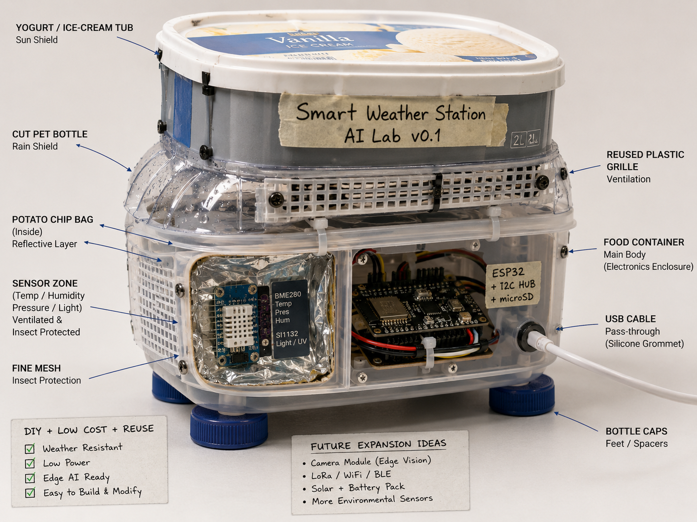

# Hardware Plan - Smart Weather Station AI Lab v0.1

## 1. Objective

The goal of version v0.1 is to build a basic physical weather station prototype using a microcontroller, environmental sensors and a recycled-material enclosure.

The system will measure:
- Temperature
- Humidity
- Atmospheric pressure
- Ambient light

This version focuses on hardware integration, sensor reading and physical prototyping. It does not include real-time AI inference yet.

## 2. Selected Board

### Recommended board

ESP32-S3 DevKit.

### Reasons

- Integrated Wi-Fi.
- Bluetooth Low Energy support.
- Good support for IoT projects.
- Compatible with ESP-IDF and Arduino framework.
- Suitable for future Edge AI / TinyML experiments.
- Enough GPIO pins for I2C sensors.

### Alternative considered

Raspberry Pi Pico W.

### Reason for not selecting it as main option

Raspberry Pi Pico W is a valid low-cost microcontroller with Wi-Fi, but ESP32-S3 is better aligned with this project's future direction: IoT, wireless sensor nodes, TinyML and embedded AI experimentation.

## 3. Initial Sensors

| Variable | Sensor | Interface | Notes |
|---|---|---|---|
| Temperature | BME280 | I2C | Environmental temperature |
| Humidity | BME280 | I2C | Relative humidity |
| Pressure | BME280 | I2C | Atmospheric pressure |
| Light | BH1750 | I2C | Ambient light in lux |

## 4. System Block Diagram

```text
┌─────────────────────────────────────────────┐
│       Smart Weather Station AI Lab v0.1      │
└─────────────────────────────────────────────┘

              ┌──────────────────┐
              │  Alimentación USB │
              │  5V desde PC o    │
              │  cargador USB     │
              └─────────┬────────┘
                        │
                        ▼
              ┌──────────────────┐
              │     ESP32-S3      │
              │  Wi-Fi + BLE MCU  │
              └───────┬─────┬────┘
                      │     │
                 I²C  │     │ USB Serial
                      │     │
        ┌─────────────┘     └──────────────┐
        ▼                                  ▼
┌─────────────────┐              ┌──────────────────┐
│     BME280       │              │  PC / Laptop      │
│ Temp / Hum /     │              │  Serial monitor   │
│ Pressure         │              │  CSV futuro       │
└─────────────────┘              └──────────────────┘
        ▲
        │ I²C compartido
        ▼
┌─────────────────┐
│     BH1750       │
│   Light sensor   │
│   Lux reading    │
└─────────────────┘


Carcasa:
┌─────────────────────────────────────────────┐
│ Zona sensores: ventilada y protegida lluvia │
│ Zona electrónica: más cerrada y seca        │
└─────────────────────────────────────────────┘
```
## 5. Technical Risks

- Risk 1: Incorrect Temperature measurement
- Risk 2: Humidity and condensation
- Risk 3: Direct rain over sensors
- Risk 4: I2C unstable long cables
- Risk 5: Inaccurate light reading

## 6. Available Material found at home
- Small tupperware -> main electronics enclosure
- Cut PET bottle -> Rain shield
- Yougurt or ice-cream tub -> Sun shield
- Reused plastic grille - > Ventilation
- Plastic bottle cap -> Feet or spacers
- Fine mesh -> Insect protection
- Potato Chip Bag -> Reflective inner layer
- Plastic-coated cardboard -> Mockup only, not for outdoor use

## Recycled Enclosure Concept

The v0.1 enclosure will be built using common reused household materials such as a plastic food container, a cut PET bottle, an ice-cream or yogurt tub, reused plastic grille, bottle caps, fine mesh and reflective material from a potato chip bag.

The goal of this enclosure is not to be a final industrial design, but to create a low-cost physical prototype that protects the electronics, allows air circulation around the sensors and demonstrates practical engineering thinking.



### Main design ideas

- The plastic food container acts as the main electronics enclosure.
- The PET bottle works as a rain shield.
- The yogurt or ice-cream tub acts as a basic sun shield.
- The sensor area is ventilated and protected with mesh.
- The ESP32 is placed in a more protected area.
- Bottle caps are used as feet or spacers.
- The USB cable has a dedicated pass-through.